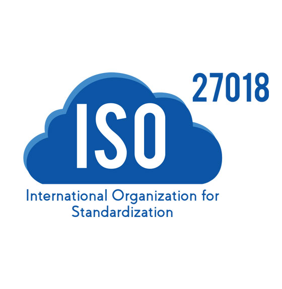

# ISO 27018

## Het ontstaan van de ISO 27018
Sinds 8 augustus bestaat de ISO 27018. Deze standaard is geschreven door de 'International Organization for Standardization' (ISO) in samenwerking met de 'International Electrotechnical Commision' (IEC). De ISO is een onafhankelijke organisatie die leden heeft in 165 landen en gespecialiceerd is in het vastleggen van standaarden.
De IEC is een organisatie gevestigd in Zwitserland die zich over het algemeen richt op de ontwikkeling en publicatie van internatiole normen voor elkektirsche componenten en apparatuur. Bekende voorbeelden van deze organisatie zijn de IP-codes die aangeven hoe stof en vocht bestendigd toestellen zijn (bijvoorbeeld IP68).

De ISO 27018 standaard is ontwikkeld door deze organisaties zodat deze als referentie kan dienen voor het kiezen van de juiste protectiemaatregelen tijdens het implementeren van de beveiliging van persoonlijke identificeerbare informatie (PII) via de cloud. De ISO 27018 is de eerste internationale standaard die zich focust op de beveiliging van PII-informatie in de cloud. De ISO 27018 geeft hiervoor richtlijnen die gebaseerd zijn op ISO 27002. Volgens ictrecht.nl is de ISO 27018 voornamelijk een uitwerking van de meer algemene privacy standaard ISO 27002 aangepast aan de cloud. 

Verschillende public cloud providers zoals Microsoft Azure en AWS zijn ISO 27018 gecertificeerd. Deze ISO 27018 standaard is van toepassing op alle soorten organisaties zowel in de publieke als private sector en non-profit organisaties, die PII verwerken via de cloud. Voor deze organisaties is het relevant om te weten of de cloud provider die zij overwegen ISO 27018 gecertificeerd is.

In het verleden was het niet mogelijk om te controleren hoe clouddienstverleners persoonsgegevens verwerkte in hun systemen. Door de explosieve groei van de cloud werd vanuit Europese privacy-toezichthouders de vraag steeds sterker voor een norm van het verwerken van persoonsgegevens in de cloud.

## De bijdrage die ISO 27018 levert
Met de komst van het ISO 27018 standaard worden er eisen gesteld aan deze clouddienstverleners waar zij aan moeten voldoen. Ictrecht.nl definieert de belangrijkste eisen als volgt:
-	Toestemming: er mogen alleen persoonsgegevens worden verwerkt als de klant hier opdracht voor heeft gegeven, met name gebruik van persoonsgegevens voor marketingdoeleinden is alleen toegestaan na expliciete toestemming.
-	Beheer: klanten moeten te allen tijde de mogelijkheid hebben om het beheer te voeren over hun persoonsgegevens.
-	Transparantie: clouddienstverleners moeten hun klanten duidelijk informeren over waar de persoonsgegevens staan opgeslagen. Als er gebruik gemaakt wordt van onderaannemers dan dient dit bekend gemaakt te worden en zal de clouddienstverlener hier heldere afspraken mee moeten maken over de verwerking van persoonsgegevens.
-	Communicatie: in het geval van een datalek dient de klant op een juiste wijze op de hoogte gehouden te worden en moet er ondersteuning plaatsvinden bij de communicatie naar de betrokkenen toe.
-	Personeel: iedere medewerker van de clouddienstverlener die toegang heeft tot de persoonsgegevens zal een geheimhoudingsverklaring ondertekenen.
-	Overheid: als er overheidsinstanties zoals politie en justitie toegang heeft verkregen tot de persoonsgegevens van klanten dan is de clouddienstverlener verplicht dit te melden.

Doordat de clouddienstverleners zich moeten houden aan de regels van dit framework (als zij compliant willen zijn aan de ISO 27018) geeft het klanten inzicht in wat zij kunnen verwachten als hun persoonsgegevens opslaan bij de clouddienstverlener. Op basis van deze informatie kunnen klanten hun governance inrichten/bijwerken. 

## ISO 27018 en Cloud Governance
De ISO 27018 heeft vooral raakvlakken met de security en compliance aspecten van Cloud Governance. Zo beschrijft de standaard niet hoe je kosten kunt beheersen, hoe change management uitgevoerd moet worden et cetera. Daarmee is de ISO 27018 dus geen compleet Cloud Governance framework. Het focust zich echt specifiek op de beveiliging van PII in de cloud. Het geeft daarmee een oplossing voor Europese bedrijven die willen hosten bij Amerikaanse Cloud Providers en moeten voldoen aan de GDPR. 

De ISO 27018 beschrijft niet hoe de security in of van de cloud benaderd moet worden. Hiervoor is de al langer bestaande ISO 27001 en ISO 27017 vereist die dit namelijk wel afdekken. Ook is het belangrijk dat een cloudafnemer beseft dat hij/zij verantwoordelijk blijft voor de PII die zij verwerken via de cloud. Het betekent niet dat deze gegevens in de cloud automatisch veilig zijn, ook al is de cloud provider ISO 27018 gecertificeerd.

## Clouddienstverleners en ISO 27018
Gezien de vertrouwelijkheid die ISO 27018 met zich meebrengt, willen alle clouddienstverleners hieraan voldoen. Alle grote clouddienstverleners zoals AWS, Azure, GCP, alibaba cloud en dergelijke voldoen hierdoor ook aan deze certificering. Ook verschillende andere partijen zoals SaaS-providers (bijvoorbeeld Saleforce) of consumenten cloudproducten (zoals Dropbox) zijn ISO 27018 gecertificeerd. 

Microsoft Azure is de voorloper, zij waren als eerst ISO 27018 gecertificeerd in februari 2015. Echter geld deze certificering niet altijd voor alle services of binnen alle regio’s die een cloud provider aanbiedt. Elke cloudprovider beschrijft in hun documentatie duidelijk welke services aan de ISO 27018 certificering voldoen. Uiteraard valt dit ook te lezen in het ISO 27018 certificaat van de cloud providers zelf.

Om ervoor te zorgen dat bedrijven compliant blijven met ISO 27018, moeten zij minimaal 1 keer per jaar laten auditen door een erkende third-party certificeringsbedrijf. De clouddienstverleners moeten dan bewijs aanleveren dat zij hun processen naleven volgens de eisen van de ISO. Als dit wordt goed gekeurd, dan wordt de certificering voor een jaar verlengt.

### Filmpje
- https://www.youtube.com/watch?v=ltLntY3HvGw

### Bronnen:
- https://www.ictrecht.nl/blog/iso-27018-de-nieuwe-standaard-voor-privacy-in-de-cloud
- https://en.wikipedia.org/wiki/International_Organization_for_Standardization
- https://csrc.nist.gov/glossary/term/PII
- https://www.iso.org/standard/61498.html
- https://aws.amazon.com/blogs/security/aws-obtains-iso-27018-privacy-certification/
- https://www.iso27001security.com/html/27018.html
- https://compliance.salesforce.com/en/iso-27018
- https://aws.amazon.com/compliance/iso-certified/
- https://azure.microsoft.com/nl-nl/blog/azure-first-cloud-computing-platform-to-conform-to-isoiec-27018-only-international-set-of-privacy-controls-in-the-cloud/
- https://docs.microsoft.com/en-us/compliance/regulatory/offering-iso-27018